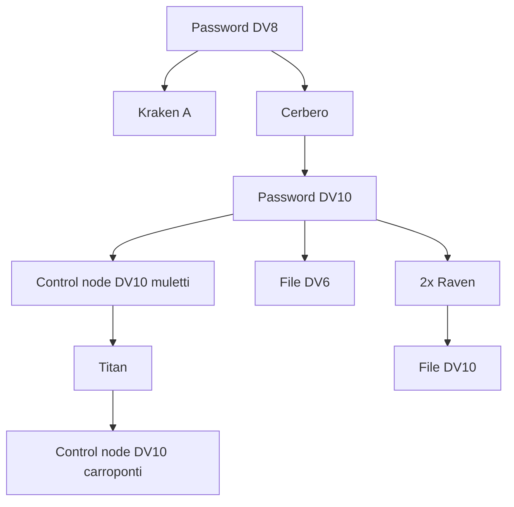
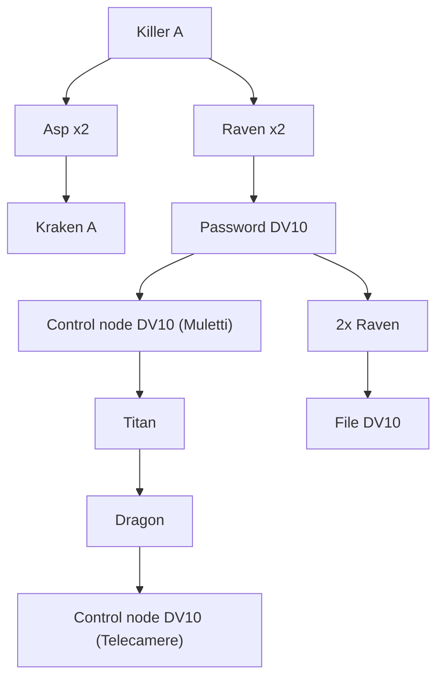

### Premessa
La crew vuole presenziare alla riunione che si terrà al [[Dock 15]] il venerdì. Sanno che "dei capi" si incontreranno per discutere e che per questo il Dock 15 chiude anticipatamente, mandando via buona parte del personale. 

### Scena 1 - L'esterno del molo 
La configurazione del molo è già nota per via delle ricognizioni precedenti curate da [[Thomas Watterson|Thomas]], [[Yelena Olga Vetrov|Yelena]] e [[Dasan Tan|Dasan]]. La mappa esterna è la seguente.

![[Moli 15-18_344x195.png]]

In relazione a quando la crew arriverà sul luogo, la situazione potrà essere leggermente differente. Infatti, l'orario "di chiusura" a cui faceva riferimento Ivan sono le 17. 
- Prima delle 17, il molo segue le normali attività. Tutti gli operai sono presenti.
- Tra le 17 e le 18, il molo si comincia a svuotare. Buona parte degli operai comincia ad andarsene. La maggior parte di loro se ne va a piedi, uscendo dalle uscite di riferimento del molo in cui lavorano. Dal magazzino del [[Dock 18]] esce [[Dimitri Vladimir Vetrov]], per poi salire su una berlina blindata, che esce immediatamente. 
  [[Agnessa Viktorova]] esce dal magazzino del molo 18 per dirigersi verso il magazzino/ufficio del molo 15 a piedi.
- Dopo le 18, il molo è in operatività minima; rimane attivo solo il magazzino del molo 15. Una berlina blindata entra dall'ingresso carraio del molo 15, per poi parcheggiare di fronte al magazzino. Dall'auto scende [[Petar Gunn]], che entra nel magazzino. 

---

La sicurezza rimane attiva su tutto il perimetro per tutta la giornata, nella forma di una coppia di guardie per ogni ingresso pedonale e una coppia per gli ingressi carrai dei moli 15 e 18.
Le telecamere rimangono attive. 

La crew deve trovare il modo di entrare. Alcuni tra i modi possibili seguono:
- La crew si presenta come squadra di tecnici venuti a riparare dei mezzi. Questo approccio deve essere coadiuvato da abbigliamento e strumentazione adeguati.
- La crew richiede un ingresso tramite veicolo; più difficile della prima opzione, ma permette di portare un veicolo all'interno.
- La crew sfrutta il caos dell'uscita congiunta per sfruttare qualche debolezza nel perimetro. 

È legittimo pensare che Sasha e Dasan avranno problemi a farsi vedere. In questo caso, sarebbe giusto farli entrare in un secondo momento, realisticamente tramite un diversivo di qualche tipo.

---

Ci sono una serie di *access point* sparsi per i moli. Gli *access point* governano tutti la stessa architettura di rete, che controlla le apparecchiature esterne dei moli 15-18.

Il file DV6 ottenuto in profondità 5 contiene le chiavi di accesso di una lunga serie di badge. Uno di questi permette lo sblocco delle porte dei magazzini per errore (probabilmente un badge di prova che ha ricevuto privilegi troppo elevati).
Il file DV10 ottenuto in profondità 6, invece, contiene i logo degli accessi all'architettura di rete locale. 

---

Sparsi per il molo ci sono alcuni piccoli gruppi di guardie che pattugliano in modo casuale la struttura. In funzione di come il gruppo è entrato, potrebbero o no essere un problema.

---

![[Molo 15_50x43.png]]

Il molo dall'esterno si presenta come nella mappa soprastante. 
Tutti gli elementi esterni sono già stati identificati durante la ricognizione, tranne la porta che è rivolta verso il mare. 

Il portone, ingresso carraio, conduce al centro del magazzino. La porta pedonale che dà sulla strada porta all'estremità del magazzino, vicino alle scale che portano agli uffici. La porta che dà sul mare, invece, conduce alla stanza della sicurezza, che è accessibile anche dal magazzino. 

![[security_room_12x14.png|300]] ![[Molo 15 - Interno_39x31.png]]

---

Tutti i punti di accesso del magazzino interno sono collegati alla seguente architettura di rete.

Il file trovato in profondità 5 include le registrazioni della giornata. Le registrazioni sono senza audio per risparmiare spazio di archiviazione, ma lo stream diretto è con audio.

---

Il magazzino sarà sorvegliato da 2 guardie, che pattuglieranno regolarmente il perimetro. 
Inoltre, nella stanza della sicurezza sarà presente un membro dei Vyriy, impegnato sulla console che da' le spalle al magazzino.

Al piano superiore, nella sala riunioni, saranno invece presenti, per i Vyriy, Agnessa e la sua guardia del corpo, [[Sashlok Pavlosky]] e Petar per il Consortium con un paio di sgherri. 

---

Le guardie dei Vyriy seguono questo *statblock*:

![[Vyriy goon - SB]]

Gli sgherri del Consortium, invece, questo:

![[Consortium goon - SB]]

---

Nel caso in cui la crew dovesse riuscire con successo ad ascoltare la riunione tra Agnessa e Petar, verranno discussi i seguenti temi. 
- Petar inizierà chiedendo se ci sono stati problemi nel trasporto delle casse agli [[Scavengers]] di questa settimana. Agnessa risponderà negativamente. 
- Agnessa chiederà aggiornamento riguardo le fonti. Petar comunicherà che [[Amado Villanueva|Amado]] riporta ben poco e che da parte sua non sembrano esserci grandi novità. [[Saveliy Viktorov|Saveliy]], invece, comincia a riportare un certo malcontento. 
- Agnessa si lamenterà con Petar dell'operato di Amado. Petar risponderà che lei stessa sembra star perdendo tempo, inquisendo sul perchè il martedì non sia mai al molo. Agnessa risponderà che dove va il martedì non sono affari di nessuno.
- Petar chiederà come è andato l'incontro con "lo stronzo", avvenuto qualche ora prima. Agnessa risponderà di aver stretto i denti, poiché per quanti "stronzo" si parla sempre di uno dei principali finanziatori. Petar risponderà di capire, dicendo che il lunedì è un giorno di stress per lui per via del suo incontro con "lo stronzo" a [[Watson]].
- Chiuderanno l'incontro ribadendo di dover accelerare il passo, visto che la scadenza del progetto è vicina e i finanziatori potrebbero perdere molto. 

---

A questo punto, inserire una complicazione a scelta.

--- 

### Riepilogo di quanto accaduto
- La crew ha causato dei danni presso il molo 16, schiantando un container contro il magazzino come diversivo. 
- La crew ha ucciso una guardia, lasciandola nascosta nell'armadio nella stanza di sicurezza. Non sono state usate armi. 
- Sono state ottenute le seguenti informazioni ascoltando la riunione tra Agnessa e Petar:
	- Agnessa si prende i martedì liberi e non vuole discutere di cosa fa
	- Si è scoperto che due membri dell'organizzazione si chiamano Amado e Saveliy
	- Si è scoperto che sia Agnessa che Petar hanno riunioni frequenti con "lo stronzo" (Dimitri Vetrov), che è però uno dei principali finanziatori
	- Si è scoperto che Consortium e Vyiry mirano a generare malcontento in una certa comunità (non si sa quale)
	- Agnessa ha richiesto che gli Scavengers vengano pressati per lavorare più in fretta
- [[Dasan Tan|Dasan]] ha rivelato l'identità di Petar, rivelando parzialmente il loro legame
- [[Yelena Olga Vetrov|Yelena]] ha riconosciuto Dimitri, ma non ha voluto rivelare il suo legame con lui. 
	- Ha fornito informazioni riguardo la sua affiliazione. 
- Yelena ha lasciato un Cloak DV 15 nell'architettura di rete della stanza di sicurezza.