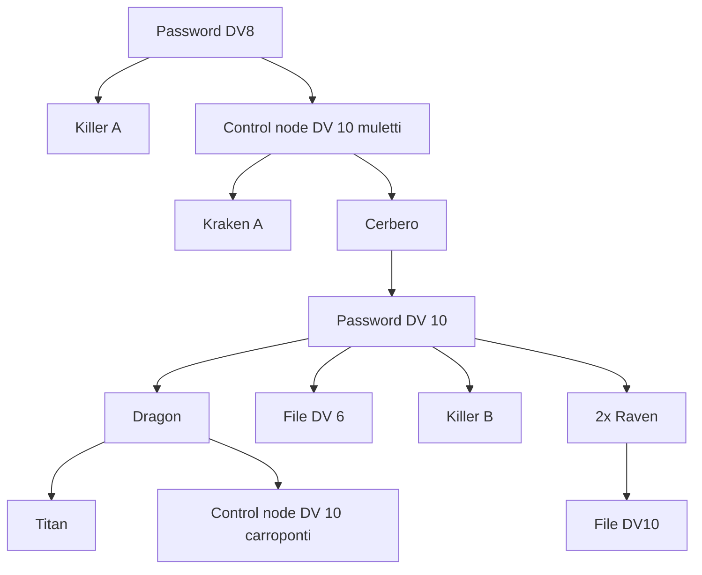

### Premessa
La crew vuole presenziare alla riunione che si terrà al [[Dock 15]] il venerdì. Sanno che "dei capi" si incontreranno per discutere e che per questo il Dock 15 chiude anticipatamente, mandando via buona parte del personale. 

### Scena 1 - L'esterno del molo 
La configurazione del molo è già nota per via delle ricognizioni precedenti curate da [[Thomas Watterson|Thomas]], [[Yelena Olga Vetrov|Yelena]] e [[Dasan Tan|Dasan]]. La mappa esterna è la seguente.

![[Moli 15-18_344x195.png]]

In relazione a quando la crew arriverà sul luogo, la situazione potrà essere leggermente differente. Infatti, l'orario "di chiusura" a cui faceva riferimento Ivan sono le 17. 
- Prima delle 17, il molo segue le normali attività. Tutti gli operai sono presenti.
- Tra le 17 e le 18, il molo si comincia a svuotare. Buona parte degli operai comincia ad andarsene. La maggior parte di loro se ne va a piedi, uscendo dalle uscite di riferimento del molo in cui lavorano. Dal magazzino del [[Dock 18]] esce [[Dimitri Vladimir Vetrov]], per poi salire su una berlina blindata, che esce immediatamente. 
  [[Agnessa Viktorova]] esce dal magazzino del molo 18 per dirigersi verso il magazzino/ufficio del molo 15 a piedi.
- Dopo le 18, il molo è in operatività minima; rimane attivo solo il magazzino del molo 15. Una berlina blindata entra dall'ingresso carraio del molo 15, per poi parcheggiare di fronte al magazzino. Dall'auto scende [[Petar Gunn]], che entra nel magazzino. 

La sicurezza rimane attiva su tutto il perimetro per tutta la giornata, nella forma di una coppia di guardie per ogni ingresso pedonale e una coppia per gli ingressi carrai dei moli 15 e 18.
Le telecamere rimangono attive. 

La crew deve trovare il modo di entrare. Alcuni tra i modi possibili seguono:
- La crew si presenta come squadra di tecnici venuti a riparare dei mezzi. Questo approccio deve essere coadiuvato da abbigliamento e strumentazione adeguati.
- La crew richiede un ingresso tramite veicolo; più difficile della prima opzione, ma permette di portare un veicolo all'interno.
- La crew sfrutta il caos dell'uscita congiunta per sfruttare qualche debolezza nel perimetro. 

È legittimo pensare che Sasha e Dasan avranno problemi a farsi vedere. In questo caso, sarebbe giusto farli entrare in un secondo momento, realisticamente tramite un diversivo di qualche tipo. 

Ci sono una serie di *access point* sparsi per i moli. Gli *access point* governano tutti la stessa architettura di rete, che controlla le apparecchiature esterne dei moli 15-18.

